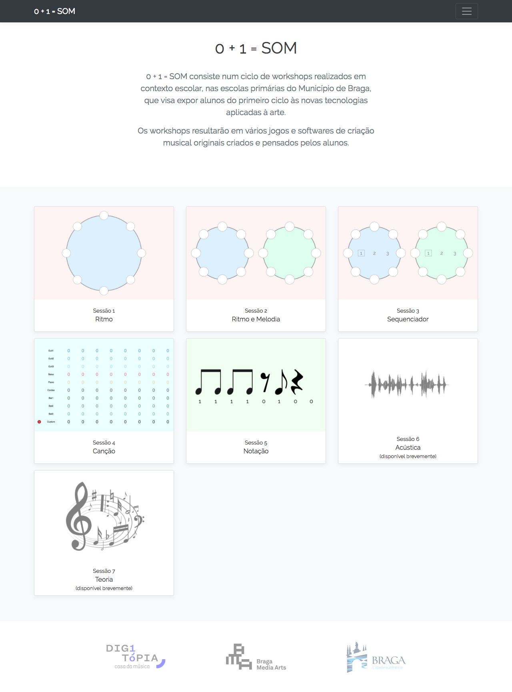

[](https://travis-ci.org/Digitopia/01som)



Website for 01 som project

This contains the code for the 01 som project, a partnership between Digitópia Casa da Música and Câmara Municipal de Braga/Braga Media Arts.

### Development

Install all project dependencies with:

```bash
npm install
gem install sass
```

Then, run `npm run dev`, which has watch mode and will compile everything as needed.

Check `package.json` for more self-explanatory info.
