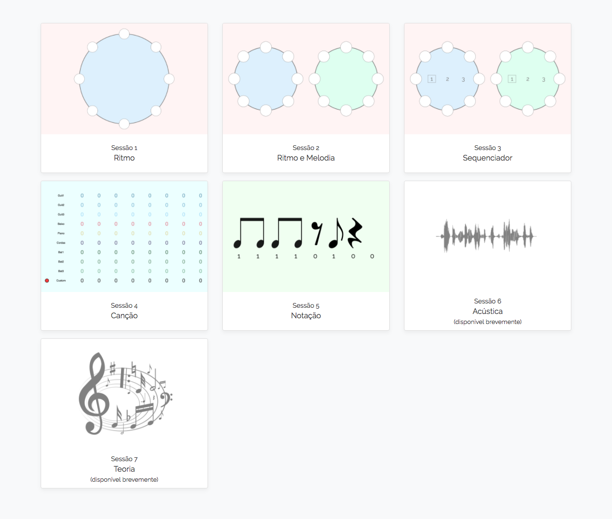
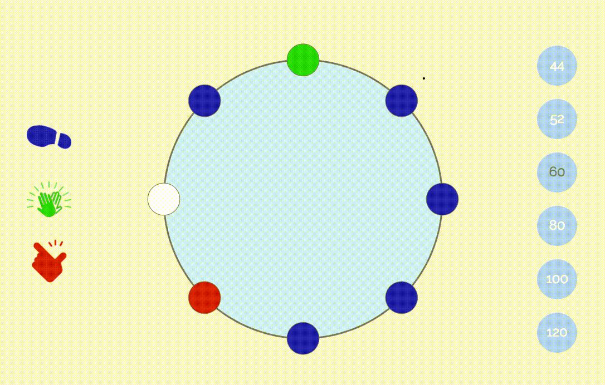

[](https://travis-ci.org/Digitopia/01som)

0 + 1 = SOM is a series of (ongoing) workshops that are conducted in primary schools of
the municipality of Braga (Portugal), with the primary goal of exposing students since an
early age to the new technologies, within the context of music.

This project is a partnership between
[Digitópia](https://digitopia.casadamusica.com) ([Casa da
Música](http://www.casadamusica.com/)), [Câmara Municipal de
Braga](https://www.cm-braga.pt) and [Braga Media
Arts](http://www.bragamediaarts.com/).

<p align="center">
    
    <!--  -->
</p>

### Development

Install all project dependencies with:

```bash
npm install
gem install sass
```

Then, run `npm run dev`, which has watch mode and will compile everything as needed. You might need to edit the scripts in `package.json` to suit your needs.
